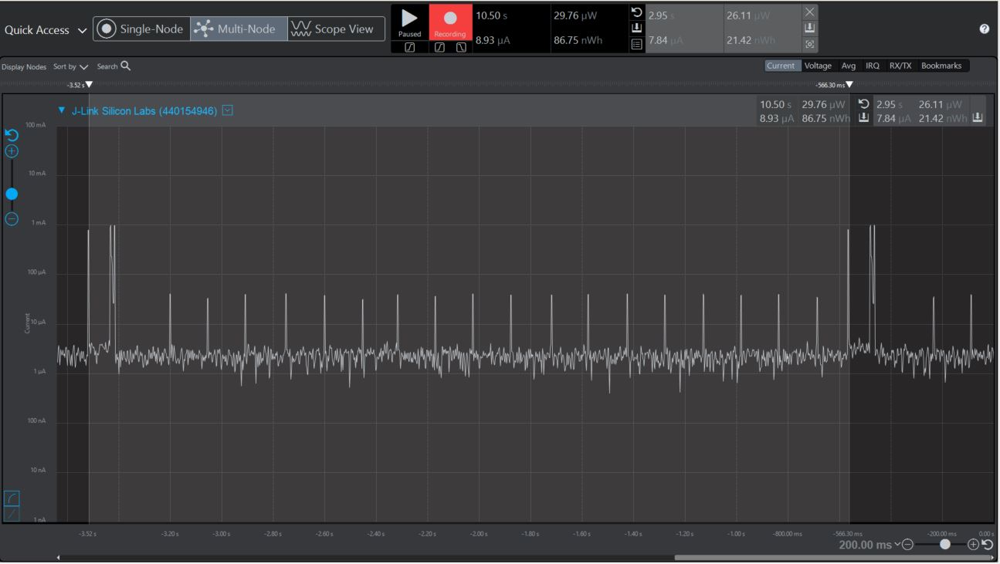
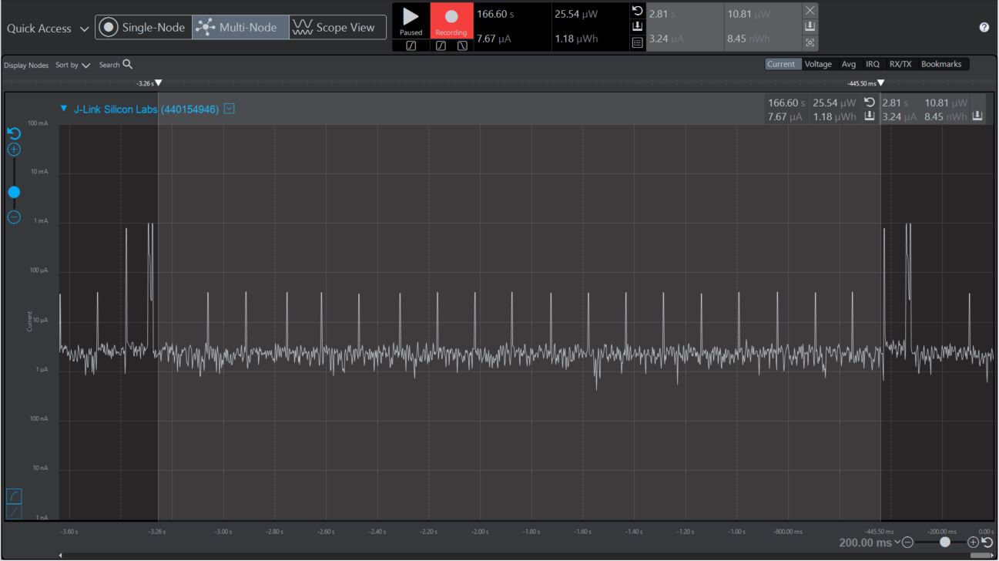
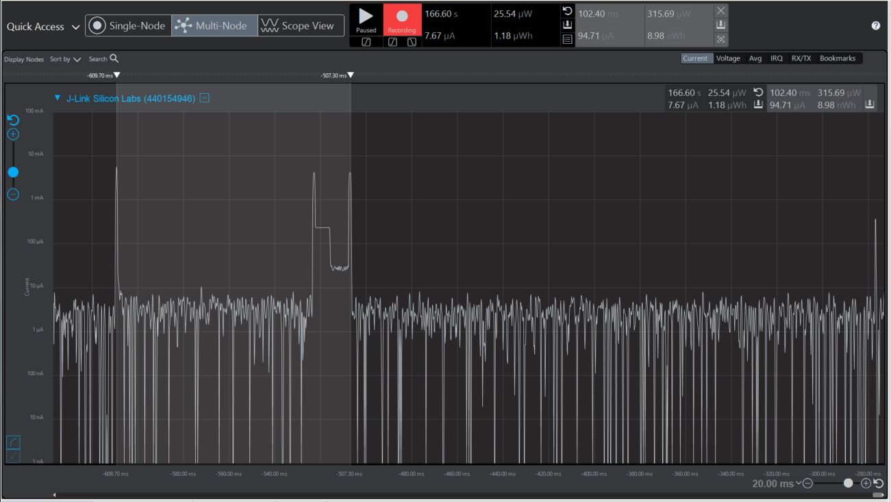

Please include your answers to the questions below with your submission, entering into the space below each question
See [Mastering Markdown](https://guides.github.com/features/mastering-markdown/) for github markdown formatting if desired.

*Be sure to take measurements in the "Default" configuration of the profiler to ensure your logging logic is not impacting current/time measurements.*

*Please include screenshots of the profiler window detailing each current measurement captured.  See [Shared document](https://docs.google.com/document/d/1Ro9G2Nsr_ZXDhBYJ6YyF9CPivb--6UjhHRmVhDGySag/edit?usp=sharing) for instructions.*

1. What is the average current per period?
   Answer: 7.84uA
    Screenshot:  
     

2. What is the average current when the Si7021 is Load Power Management OFF?
   Answer:3.24uA
    Screenshot:  
     

3. What is the average current when the Si7021 is Load Power Management ON?
   Answer:94.71uA
    Screenshot:  
     

4. How long is the Si7021 Load Power Management ON for 1 temperature reading?
   Answer: 102.40ms
    Screenshot:  
     

5. What is the total operating time of your design for assignment 4 in hours assuming a 1000mAh supply?

The Energy profiler shows it uses 64.16nWh every 10 seconds, so that means it is rated at .023mwh.
Therefore it will last 43,290 hours.

6. How has the power consumption performance of your design changed since the previous assignment?

Well in assignment 3 I did not realize I still had the LED0 on so it is much lower, but I went back and edited assignment 3 and the latest design has made a huge improvement from averaging 137.83uA per period to 7.84uA per period.  These numbers are based on the logger being disabled for both programs.  

7. Describe how you have tested your code to ensure you are sleeping in EM1 mode during I2C transfers.  

  I checked the return of Sleep_sleep() to see that the lowest energy mode is EM1.
