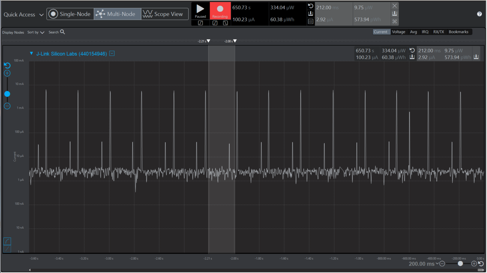

Please include your answers to the questions below with your submission, entering into the space below each question
See [Mastering Markdown](https://guides.github.com/features/mastering-markdown/) for github markdown formatting if desired.

*Be sure to take measurements in the "Default" configuration of the profiler to ensure your logging logic is not impacting current/time measurements.*

*Please include screenshots of the profiler window detailing each current measurement captured.  See [Shared document](https://docs.google.com/document/d/1Ro9G2Nsr_ZXDhBYJ6YyF9CPivb--6UjhHRmVhDGySag/edit?usp=sharing) for instructions.*

1. Provide screen shot verifying the Advertising period matches the values required for the assignment.
    Screenshot:  
     

2. What is the average current between advertisements?
   Answer: 2.92uA
    Screenshot:  
     

3. What is the peak current of an advertisement?
   Answer: 9.52mA
    Screenshot:  
     

4. Provide screen shot showing the connection interval settings. Do they match the values you set in your slave(server) code or the master's values?.
   Answer:  They do not match the values set in server's code, so they are the client's value.
    Screenshot:
     

5. What is the average current between connection intervals?
   Answer: 1.86uA
    Screenshot:  
     

6. If possible, provide screen shot verifying the slave latency matches what was reported when you logged the values from event = gecko_evt_le_connection_parameters_id.
   Answer: It is 30ms with 0 intervals, which matches question 4.
    Screenshot:  
     

7. What is the peak current of a data transmission when the phone is connected and placed next to the Blue Gecko?
   Answer: 4.12 mA
    Screenshot:  
     

8. What is the peak current of a data transmission when the phone is connected and placed approximately 20 feet away from the Blue Gecko?
   Answer:4.28mA
    Screenshot:  
     
